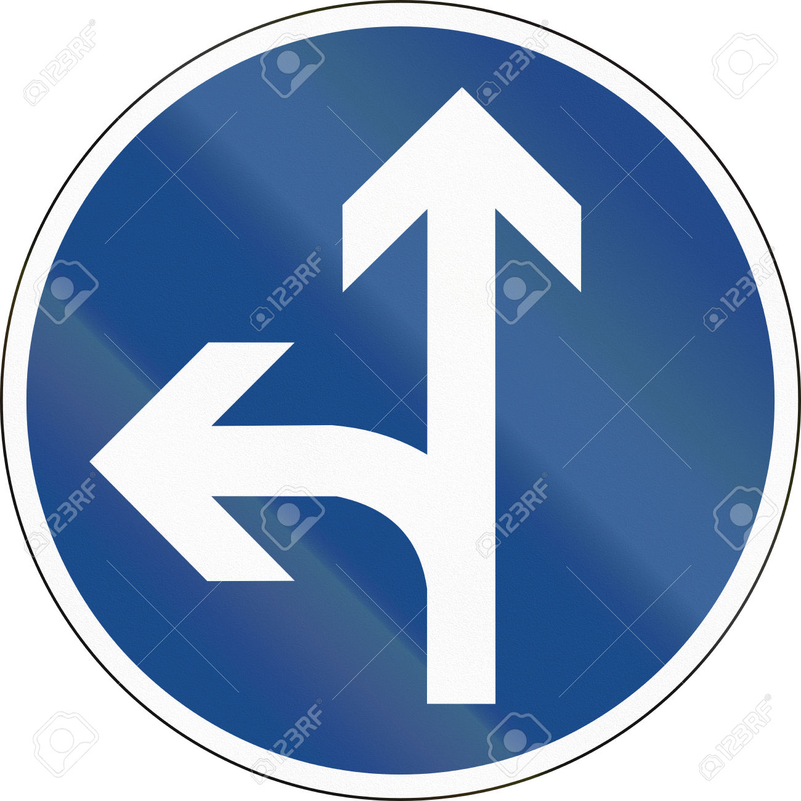
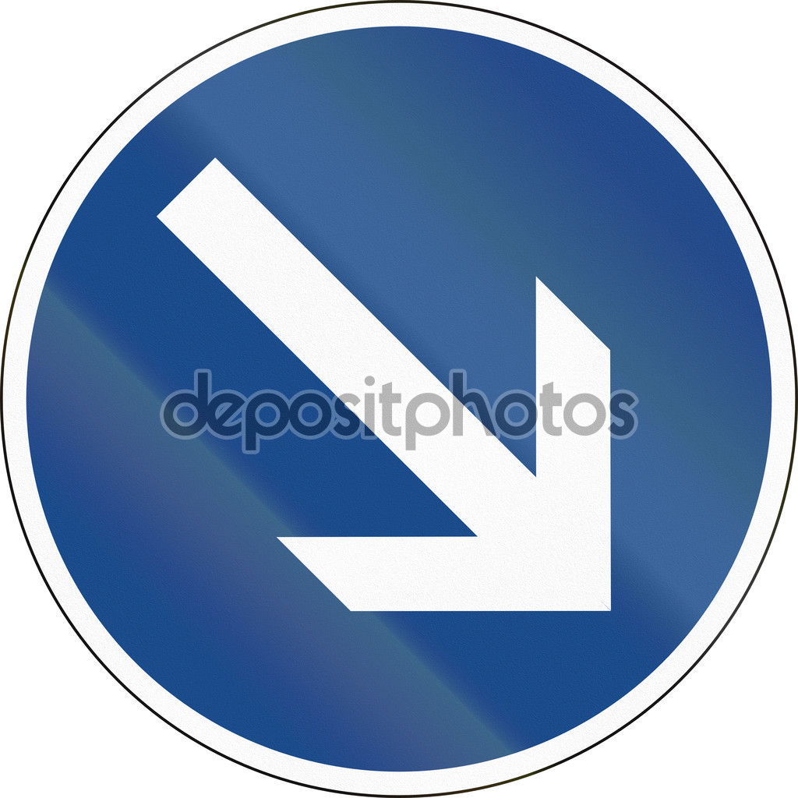
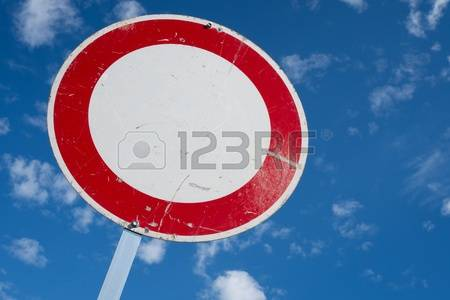
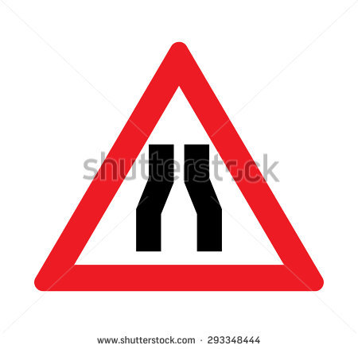
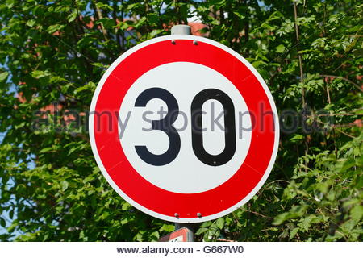

#**Traffic Sign Recognition** 

---

**Build a Traffic Sign Recognition Project**

The goals / steps of this project are the following:
* Load the data set (see below for links to the project data set)
* Explore, summarize and visualize the data set
* Design, train and test a model architecture
* Use the model to make predictions on new images
* Analyze the softmax probabilities of the new images
* Summarize the results with a written report

[//]: # (Image References)

[histogram]: ./output/output_17_0.png "Histogram"
[classDistribution]: ./output/output_19_0.png "Class Dirstribution"
[augmentedDist]: ./output/output_26_1.png "Augmented Dirstribution"
[image2]: ./examples/grayscale.jpg "Grayscaling"
[image3]: ./examples/random_noise.jpg "Random Noise"
[transformation]: ./output/output_28_0.png "Transformation"
[random]: ./output/output_30_0.png "Random Transformation"
[confusionMatrix]: ./output/output_45_1.png "Confusion Matrix"
[pred1]: ./output/output_53_0.png "Predictions"
[pred2]: ./output/output_54_0.png "Softmaxes"

## Rubric Points
###Here I will consider the [rubric points](https://review.udacity.com/#!/rubrics/481/view) individually and describe how I addressed each point in my implementation.  

---
###Writeup / README

You're reading it! and here is a link to my [project code](https://github.com/Nazanin1369/TrafficSignsClassifier/blob/master/Traffic_Sign_Classifier.ipynb)

###Data Set Summary & Exploration

####1. Provide a basic summary of the data set and identify where in your code the summary was done. In the code, the analysis should be done using python, numpy and/or pandas methods rather than hardcoding results manually.

The code for this step is contained in the three to five code cells of the IPython notebook.  

I use the basic python built-in method **len()** in order to get the required information. I have also used some numpy functionality. I have used **unique**, to get the number of classes and shape to get the image shape

* The size of training set is 34799
* The size of validation set 4410
* The size of test set is 12630
* The shape of a traffic sign image is (32, 32, 3)
* The number of unique classes/labels in the data set is 43

####2. Include an exploratory visualization of the dataset and identify where the code is in your code file.

The code for this step is contained in the third code cell of the IPython notebook.  

Basically, we need the histogram of the training, testing and validation labels. To obtain this, I use the Matplotlib **hist** method

![alt text][histogram]

And this is the class distribution for all the data:

![alt text][classDistribution]

###Design and Test a Model Architecture

####1. Describe how, and identify where in your code, you preprocessed the image data. What tecniques were chosen and why did you choose these techniques? Consider including images showing the output of each preprocessing technique. Pre-processing refers to techniques such as converting to grayscale, normalization, etc.

I tried several colorspaces, starting from original RGB followed by YUV where Y channel carries intensity information which was normalized for each image to adjust for variable lighting. I found that Y channel was almost identical to grayscale. However, this naive linear scaling is not always sufficient as evident in figure above where contrast adjustment makes a huge difference. After trial and error, I decided to use contrast limited adaptive histogram equilization (CLAHE) with tile size of 4x4. I used all color channels as this information is relevant for traffic signs. As a last step, I simply scaled RGB values to lie in the range [-0.5,0.5]. Note that actual pre-processing is applied after data augmentaion. For implementation, see code cell 13 of Project.ipynb.

Next, we need to generate fake data for several reasons :

* To balance our dataset
* For training purposes, ideally we should have had lot of tracks and only a few images per track but this is not the case.
* In general, small perturbations in our original dataset will increase robustness of CNNs later.

I generated fake data by performing geometric transformations (see code cells 15-18 of Project.ipynb). Here are some of the transformations I used :

Scaling : chosen randoly between 0.85 and 1.1 for both x and y directions.
Translation : Random shift by at most 2 pixels in x/y directions.
Rotation : Rotation by angle randomly chosen in the range (-17,17) 

![alt text][transformation]

I applied random image transforms to every odd numbered image in training dataset with the idea being that consecutive images have similar resolution. Further, I augment existing dataset to make it balanced by requiring 3000 examples per class in training set. Here is the final class distributions after augmentation : 
![alt text][augmentedDist]

To augment data, a combination of the above transformations is used. Here is an example of random transformations on the same image : 
![alt text][random]

####2. Describe how, and identify where in your code, you set up training, validation and testing data. How much data was in each set? Explain what techniques were used to split the data into these sets. (OPTIONAL: As described in the "Stand Out Suggestions" part of the rubric, if you generated additional data for training, describe why you decided to generate additional data, how you generated the data, identify where in your code, and provide example images of the additional data)

The code for splitting the data into training and validation sets is contained in the second code cell of the IPython notebook.  

To cross validate my model, I randomly split the training data into a training set and validation set. I did this by **train\_test\_split** from **sklearn.model_selection**. I split the train test by a 20%.

My final training set had 215000 number of images. My validation set and test set had 1290 and 12630 number of images. This is after data augmentation which explaained above.

####3. Describe, and identify where in your code, what your final model architecture looks like including model type, layers, layer sizes, connectivity, etc.) Consider including a diagram and/or table describing the final model.

The model I have chosen is inspired by VGGnet architecture. Consider the following arrangement :

* Conv. layer
* ReLu activation
* Conv. layer
* ReLu activation
* Pooling
* Dropout

This arrangement is repeated 3 times so that we have a total of 6 conv layers. These layers have 32, 32, 64, 64, 128 and 128 filters in that order. Each conv. layer uses 3x3 filters with stride=1 and padding=1. Pooling layer uses maxpool filters of size 2x2 with stride=2. This is followed by following arrangement :

* Full-connected layer
* ReLu activation
* Dropout

repeated twice. Each fully-connected layers has size of 128. Softmax function is applied on final output layer for computing loss.

Please see code cell 19 for implementation in Tensorflow and code cell 23 for training.

####4. Describe how, and identify where in your code, you trained your model. The discussion can include the type of optimizer, the batch size, number of epochs and any hyperparameters such as learning rate.

I used Adam optimizer with learning rate = 0.007. Batch size of 64 was used and training was done for 30 epochs. The keep_prob for dropout layers was chosen to be 0.5 for conv layers and 0.7 for FC layers.

Starting with pre-processing stage, I tried several color channels including RGB, YUV and RGB with CLAHE. I chose RGB with CLAHE as it gave best results and I believe color carries useful information for our problem.
I chose architecture similar to VGGnet because deeper layers give better results and it is also quite elegant in the sense that same size filters for conv layers and pooling are used throughout.

Padding=1 or 'SAME' padding was used in conv layers to retain information at the borders of images.
Batch size and the size of FC layers was mostly constrained by memory issues, and adding more neurons in FC layers didn't seem to help much with the accuracy.

keep_prob in dropout for FC layers was chosen to be 0.7 because a smaller value of ~0.5 led to extremely slow convergence.
I used Adam optimizer as it seems to automatically tune the learning rate with time.
A test set accuracy of 98.2% was obtained! It is quite remarkable that VGGnet inspired CNN with only minor tweaks yields such a high test accuracy.

Let us now plot the confusion matrix to see where the model actually fails. Note that we plot the log of confusion matrix due to very high accuracy. 

![alt text][confusionMatrix]

Some clusters can be observed in the confusion matrix above. It turns out that the various speed limits are sometimes misclassified among themselves. Similarly, traffic signs with traingular shape are misclassified among themselves. I believe the model can be further improved by using hierarchical CNNs to first identify broader groups like speed signs and then have CNNs to classify finer features such as the actual speed limit.

####5. Describe the approach taken for finding a solution. Include in the discussion the results on the training, validation and test sets and where in the code these were calculated. Your approach may have been an iterative process, in which case, outline the steps you took to get to the final solution and why you chose those steps. Perhaps your solution involved an already well known implementation or architecture. In this case, discuss why you think the architecture is suitable for the current problem.

The code for calculating the accuracy of the model is located in the ninth cell of the Ipython notebook.

My final model results were:

* Training set accuracy of 0.989
* Validation set accuracy of 0.995 
* Test set accuracy of 0.941

My first architecture was the LeNet architecture. I chose this architecture as starting point, to be sure everything was correctly configured. When I checked that the model was training, I started to tune several parameters.

The first problem I faced was that the architecture overfitted. The training results were good enough, but then, in the test set, the accuracy was pretty worse. To avoid this, I introduced dropout. The training results was more or less the same but the accuracy for the test set improved considerably.

Then I decided to preprocess the data using the suggestions of the paper *Traffic Sign Recognition with Multi-Scale Convolutional Networks*. I changed a rbg image for a grayscale image (I tried with the Y dimension of a YUV color transformation, but I did not notice any improvement) and I normalized the values. I changed the input dimension from 3 to 1 into the model

The last tune I did was increasing the hidden layers dimensions. I have two hidden layers, like LeNet. They have 200 and 108 dimensions each. I got this numbers from the paper. This final tune contributed very positively to the final results.

Finally, thanks to all these all changes, the results were very good. The test accuracy is 0.941 and the validation accuracy is 0.995.

###Test a Model on New Images

####1. Choose five German traffic signs found on the web and provide them in the report. For each image, discuss what quality or qualities might be difficult to classify.

Here are five German traffic signs that I found on the web:

I tried to mix very common signals, like speed-limit and stop, with others less common, like no vehicles

####2. Discuss the model's predictions on these new traffic signs and compare the results to predicting on the test set. Identify where in your code predictions were made. At a minimum, discuss what the predictions were, the accuracy on these new predictions, and compare the accuracy to the accuracy on the test set (OPTIONAL: Discuss the results in more detail as described in the "Stand Out Suggestions" part of the rubric).

The code for making predictions on my final model is located in the tewnty-nineth cell of the Ipython notebook.

![alt text][pred1]

Here are the results of the prediction:

| Image			        |     Prediction	        					| 
|:---------------------:|:---------------------------------------------:| 
| Stop      		    | Stop   									    | 
| Keep Right     		| Keep Right								    |
| No Vehicles			  | No Vehicles								    |
| 30 km/h	      		| 30 km/h					 				    |
| Road Narrows			| Road Narrows    							    |

The model was able to correctly guess 5 of the 5 traffic signs, which gives an accuracy of 100%.

![alt text][pred2]

####3. Describe how certain the model is when predicting on each of the five new images by looking at the softmax probabilities for each prediction and identify where in your code softmax probabilities were outputted. Provide the top 5 softmax probabilities for each image along with the sign type of each probability. (OPTIONAL: as described in the "Stand Out Suggestions" part of the rubric, visualizations can also be provided such as bar charts)

The code for making predictions on my final model is located in the 30th cell of the Ipython notebook.

It is interesting that the sucess images have a softmax index 1, instead of the wrong one.
Clearly the model recognize the shapes very well. 

The first image is a **Stop**

| Probability         	|     Prediction	        					| 
|:---------------------:|:---------------------------------------------:| 
| 1.0        			| Stop   									    | 
| 0.0     				| Irrelevant 									|
| 0.0					| Irrelevant									|
| 0.0	      			| Irrelevant					 				|
| 0.0				    | Irrelevant      							    |

The second image is a  **Keep Right**

| Probability         	|     Prediction	        					| 
|:---------------------:|:---------------------------------------------:| 
| 1.0       			| Keep Right   						            | 
| 0.00     				| Irrelevant 								    |
| 0.00					| Irrelevant					|
| 0.00	      			| Irrelevant					 				|
| 0.00				    | Irrelevant      							    | 

The third image is a  **No Vehicles**

| Probability         	|     Prediction	        					| 
|:---------------------:|:---------------------------------------------:| 
| 1.00        			| No Vehicles   								| 
| 0.00     				| Irrelevant								|
| 0.00					| Irrelevant									|
| 0.00	      			| Irrelevant					 				|
| 0.00				    | Irrelevant      		

The fourth image is a  **30 km/h**

| Probability         	|     Prediction	        					| 
|:---------------------:|:---------------------------------------------:| 
| 1.00        			| 30 km/h   									| 
| 0.00     				| Irrelevant 										|
| 0.00					| Irrelevant										|
| 0.00	      			| Irrelevant					 				|
| 0.00				    |Irrelevant      		

The fifth image is a  **Road Narrows**

| Probability         	|     Prediction	        					| 
|:---------------------:|:---------------------------------------------:| 
| 1.00        			| Road Narrows   									| 
| 0.00     				| Irrelevant								|
| 0.00					| Irrelevant						|
| 0.00	      			| Irrelevant		 				|
| 0.00				    | Irrelevant      		
